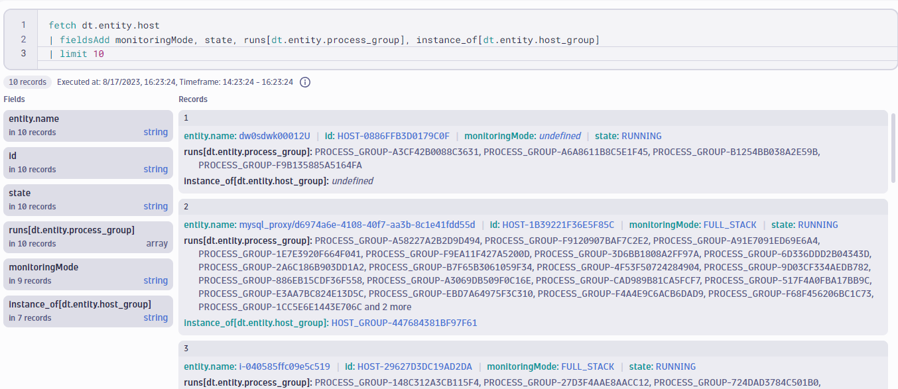

## Hands-On Exercise 2 - Querying Entities

In this section, you will practice querying entities and relationships with DQL.

---

### Step 1: Fetch a List of Hosts

We will begin by querying a list of hosts.

In a new notebook, add a new section and choose "Query Grail".


#### Write and execute a query to obtain a list of hosts. Limit to 10 results.

<br>


<details>
<summary>Click to Expand Solution</summary>
<br>
<br>

```
fetch dt.entity.host
| limit 10
```


</details>

<br>
<br>

---

### Step 2: Find Potential Fields to Add

Notice that by default, the only data returned for each host is the entity name and entity id.  To write a useful entity query, you will need to use additional fields.  To do that, you need to know what fields are available.

You can use the **describe** command to query information about the schema of a datatype.  This command will return the fields associated with a datatype.

#### Add a new section to your notebook and use the describe command to list the fields associated with the dt.entity.host datatype.

<details>
<summary>Click to Expand Solution</summary>
<br>

```
describe dt.entity.host
```


</details>

<br>
<br>

---

### Step 3: Add Additional Fields

Now that you know what fields are available to query for hosts, you can add additional fields to the output by using the **fieldsAdd** command.

Note: When using the fieldsAdd command, you will see a list of suggested fields you can add to the results.  

<!--  -->

#### Add monitoring mode and state to the results of your original query.

<details>
<summary>Click to Expand Solution</summary>

```
fetch dt.entity.host
| fieldsAdd monitoringMode, state
| limit 10
```


</details>
<br>
<br>

---

### Step 4: Add Related Entities

Entity relationships are available to add as fields in a DQL query.  This includes relationships such as:
- which hosts belong to a host group
- which processes run on a host
- which services run on a process group

and many more.


#### Using a relationship function, add the host group to which each host belongs to your query

(**Hint**: See the [Relationship Mapping Table](https://www.dynatrace.com/support/help/shortlink/grail-querying-monitored-entities#relationship-mapping-table) for information on the relationship functions available in DQL.)
<br>

<details>
<summary>Click to Expand Solution</summary>

```
fetch dt.entity.host
| fieldsAdd monitoringMode, state, instance_of[dt.entity.host_group]
| limit 10
```



</details>
<br>
<br>

---

### Step 5: Lookup Host Group Name

In the last step, you added the entity id of the host group related to each host.  However, it would be more user friendly to have the names of these entities included in the results.

The **lookup** command can be used to join data from related entities.

Reference: [Lookup Command Documentation](https://www.dynatrace.com/support/help/shortlink/dql-commands#lookup)

<br>

For example, the following query fetches a list of service instances, the hosts they run on, and then the names of those hosts using the **lookup** command.

Query:
```
fetch dt.entity.service_instance
| fieldsAdd runs_on[dt.entity.host]
| lookup sourceField:`runs_on[dt.entity.host]`, lookupField:id, [ fetch dt.entity.host ]
```
Result:


<br>

#### Using the lookup command, add the name of the host group to the results.
<br>


<details>
<summary>Click to Expand Solution</summary>

```
fetch dt.entity.host
| fieldsAdd monitoringMode, state, instance_of[dt.entity.host_group]
| lookup sourceField:`instance_of[dt.entity.host_group]`, lookupField:id, [ fetch dt.entity.host_group]
```


</details>
<br>
<br>

**Note:** 

The **lookup** command will only work if the sourceField value is a <u>single ID</u>.  If the sourceField value is a list, such as a list of process groups, the query will return an error.


In this case, you would first need to use the **expand** command to retrieve individual records per process group.  This is not covered in this lab.  To learn more, see [documentation](https://www.dynatrace.com/support/help/shortlink/grail-querying-monitored-entities#expand-relationships).

<br>
<br>