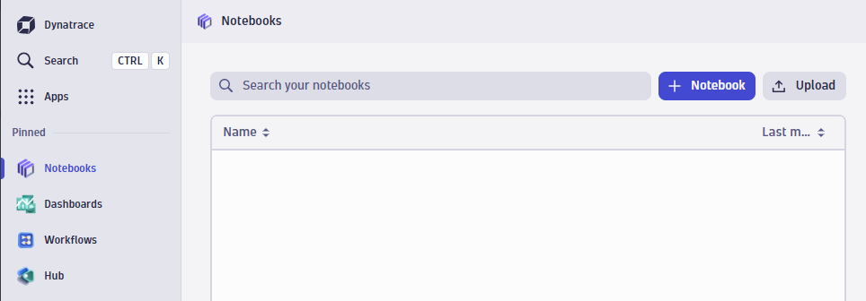
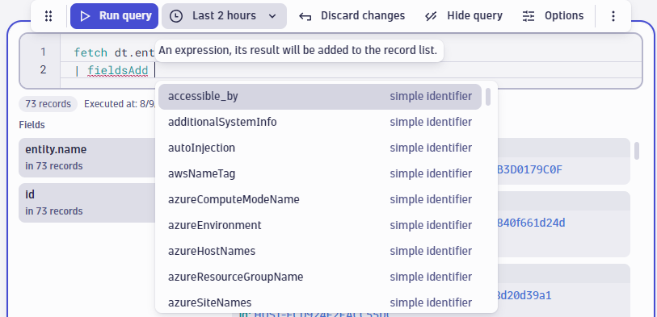

## Hands-On Exercise 2 - Querying Entities

In this section, you will practice querying entities and relationships with DQL.

---

### Step 1: Create a New Notebook

For this exercise, we will be querying Grail from within a Notebook.

Navigate to the **Notebooks** application and create a new notebook.

Name this notebook "Entity Exercises".



---

### Step 2: Get a List of Hosts

In our new notebook, we will begin by querying a list of hosts.

Add a new section to your notebook and choose "Query Grail".

Run the following query to get a list of hosts.  

```
fetch dt.entity.host
```

#### Result:


---

### Step 3: Add Additional Fields

Notice that by default, the only data returned for each host is the entity name and entity id.  

You can add additional fields to the output by using the **fieldsAdd** command.

Add the fieldsAdd command to your query.  You will see a list of suggested fields you can add to the results.  



Add monitoring mode and state to the results.


<details>
<summary>Expected Solution</summary>

```
fetch dt.entity.host
| fieldsAdd monitoringMode, state
```


</details>

---

### Step 4: Add Related Entities

Entity relationships are available to add as fields in a DQL query.  This includes relationships such as:
- which hosts belong to a host group
- which processes run on a host
- which services run on a process group

and many more.


Using a relationship field, add a list of process groups running on each host to the results.

(**Hint**: See the [Relationship Mapping Table](https://www.dynatrace.com/support/help/shortlink/grail-querying-monitored-entities#relationship-mapping-table) for information on the relationship fields available in DQL.)


<details>
<summary>Expected Solution</summary>

```
fetch dt.entity.host
| fieldsAdd monitoringMode, state, runs[dt.entity.process_group]
```


</details>